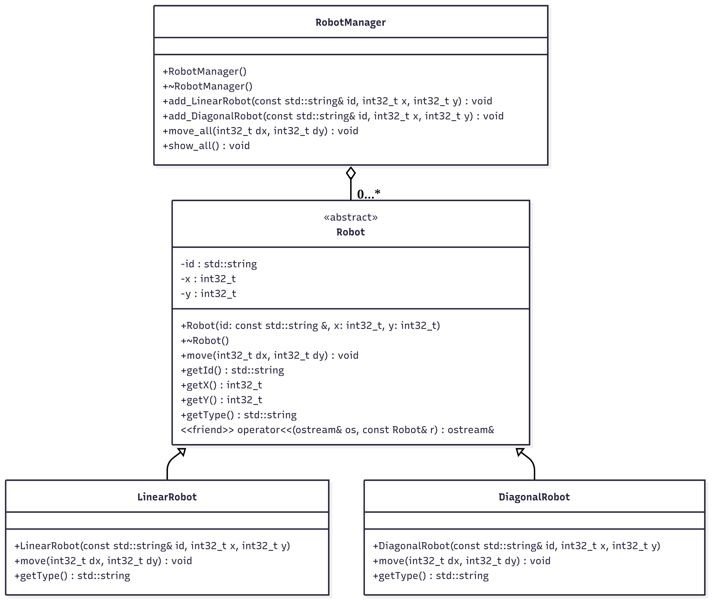

# Ejercicio 1: Programación Orientada a Objetos (6.5 puntos)

En este ejercicio vas a implementar una jerarquía de clases en C++ para simular diferentes tipos de **robots móviles**, cada uno con un comportamiento de movimiento diferente.

## Descripción general

El sistema, representado por la clase `RobotManager`, consiste en un conjunto de **robots** que se encuentran posicionados en un plano 2D y pueden desplazarse de acuerdo con reglas específicas según el tipo de robot. Cada robot tiene un identificador, una posición (x, y), y una función `move` que debe ser implementada según el tipo de robot, ya que cada uno realizará el movimiento de una determinada manera.

### Cosas a considerar
- Debes decidir si algún método **necesita ser constante**. En el diagrama UML no se indicará.
- Debes decidir **qué métodos deberán tener enlace dinámico** y también **si algún método no debe de tener implementación (método abstracto)**. Fíjate en las relaciones entre las clases para decidirlo.
- Puedes modificar `main_e1.cc` si quieres para probar tu código y asegurarte de que el enlace dinámico es correcto y que se cumple la especificación del ejercicio.
- Que no se te olvide añadir la **guarda de cabecera** tal y como se hacía con las prácticas durante el curso, mediante las directivas del preprocesador (`#ifndef`, `#define` y `#endif`).
- Tienes un **diagrama de clases UML** más abajo.
- **IMPORTANTE**: En los archivos de partida podrás encontrar todos los ficheros que necesitas ya creados pero vacíos. No necesitarás crear más ficheros para la entrega.
---

## Clases a implementar


### Clase `Robot`

Representa un robot de cualquier tipo. Esta clase será abstracta, por lo que no se podrán crear instancias de dicha clase.

#### Atributos:
- `std::string id` – Identificador del robot
- `int32_t x, y` – Posición actual del robot

#### Métodos:
- `Robot(const std::string& id, int32_t x, int32_t y);`
  - Inicializa los atributos de la clase.
  - **Importante**: Si se intenta crear un robot con un identificador vacío, debe lanzarse una excepción con la instrucción `throw std::exception();`. Recuerda que `std::exception` se trata de una clase de la librería estándar `STD`. 
- `~Robot()`
    - Destructor por defecto. No debe hacer nada.
- `void move(int32_t dx, int32_t dy)`
  - Realiza un desplazamiento del robot sumando las coordenadas actuales del robot con las recibidas por parámetro. Los parámetros recibidos representan la cantidad que se desplaza el robot en cada eje. El desplazamiento puede ser negativo.
- **Métodos accesores**:
    - `std::string getId()`
    - `int32_t getX()`
    - `int32_t getY()`
- `std::string getType()`
    - Método que devolverá el tipo de robot en formato `std::string`. El valor contendrá exactamente el nombre de la clase de robot.
- `std::ostream& operator<<(std::ostream& os, const Robot& r);`
  - Añade al flujo de salida información sobre el robot, incluyendo el `tipo`, el `id` y la `posición` del robot **sin salto de línea** y con el siguiente formato: 
    `[Tipo] ID at (x, y)`. Por ejemplo:
    ```
    [LinearRobot] R1 at (0, 3)
    ```

---


### Clase `LinearRobot` (hereda de `Robot`)

Representa un robot que solo puede moverse **en línea recta** (solo eje X o eje Y).

#### Métodos:
- `LinearRobot(const std::string& id, int32_t x, int32_t y)`
    - Constructor de la clase, donde se inicializarán los atributos del objeto.
- `void move(int32_t dx, int32_t dy)`
  - Desplazará al robot solo si **dx == 0** o **dy == 0**. Si no se cumple, el robot no cambia su posición.
- `std::string getType()`
  - Devuelve la cadena: `"LinearRobot"`

---

### Clase `DiagonalRobot` (hereda de `Robot`)

Representa un robot que solo puede moverse **en diagonal**, es decir, desplazamientos donde el valor absoluto del desplazamiento `dx` es igual al valor absoluto del desplazamiento `dy`. Puedes utilizar la función `std::abs`, que devuelve el valor absoluto del parámetro recibido. Necesitarás incluir la siguiente cabecera para poder utilizarlo:
`#include <cmath>`

#### Métodos:
- `DiagonalRobot(const std::string& id, int32_t x, int32_t y);`
    - Constructor de la clase, donde se inicializarán los atributos del objeto.
- `void move(int32_t dx, int32_t dy)`
  - Desplazará al robot solo si el valor absoluto de `dx` es igual al valor absoluto de `dy`. Si no se cumple, el robot no cambiará su posición.
- `std::string getType()`
  - Devuelve la cadena: `"DiagonalRobot"`

---

### Clase `RobotManager`

Permite almacenar un número indeterminado de robots (podría ser 0 también) y aplicar operaciones sobre ellos. Fíjate en la relación en el diagrama UML entre `RobotManager` y `Robot` y tenlo en cuenta en la implementación.

#### Métodos:
- `RobotManager();`
  - Constructor por defecto. No tiene que hacer nada.
- `~RobotManager();`
  - Libera la memoria dinámica que hayas reservado dentro de la clase.
- `void add_LinearRobot(const std::string &id, int32_t x, int32_t y)`
  - Añade un nuevo robot de tipo `LinearRobot`.
  - Captura la excepción del constructor de `Robot` con un bloque `try-catch` como se ha visto en clase. Si se captura la excepción lanzada con `throw` en el constructor, no se añade el nuevo robot. Tampoco se mostrará ningún mensaje de error.
- `void add_DiagonalRobot(const std::string &id, int32_t x, int32_t y)`
  - Añade un nuevo robot de tipo `DiagonalRobot`.
  - Captura la excepción del constructor de `Robot` con un bloque `try-catch` como se ha visto en clase. Si se captura la excepción lanzada con `throw` en el constructor, no se añade el nuevo robot. Tampoco se mostrará ningún mensaje de error.
- `void move_all(int32_t dx, int32_t dy);`
  - Aplica `move(dx, dy)` a todos los robots almacenados.
- `void show_all();`
  - Muestra todos los robots en la consola usando el `operator<<` del `Robot`. Añade un salto de línea después de cada robot.

**Nota**: A modo de recordatorio, tienes un ejemplo de uso del bloque `try-catch` en `main_e1.cc`. Recuerda que para poder capturar una excepción, antes hay que haberla lanzado con la instrucción `throw`. Tal instrucción deberías haberla usado en el método que se indica en el enunciado.

---
## Diagrama de clases UML

- A continuación se muestra el diagrama UML con una visión general de cómo debería quedar tu programa, pero recuerda que no se indica ningún método constante, ni método abstracto ni método con enlace dinámico. Según la especificación y la relación entre las clases, debes decidir en qué parte del código deben declararse estos 3 tipos de métodos, teniendo en cuenta los principios de diseño orientado a objetos y la responsabilidad de cada clase. 

- Puedes descargar el diagrama aquí:  <a href="../../resources/c3/c3_uml.png" target="_blank">Diagrama UML</a>


<p class="caption">Figura 1: Diagrama de clases UML del ejercicio 1.</p>


---
## Ejemplo de uso


```cpp
//main_e1.cc
#include "robotmanager.h"
#include "linearrobot.h"
#include "diagonalrobot.h"
#include <iostream>
using namespace std;

int main() {
    RobotManager manager;
    manager.add_LinearRobot("W1", 0, 0);
    manager.add_DiagonalRobot("T1", 10, 10);
    manager.add_LinearRobot("W2", -5, 2);

    std::cout << "== ESTADO INICIAL ==" << std::endl;
    manager.show_all();

    manager.move_all(2, -2);

    std::cout << "\n== ESTADO TRAS MOVER ==" << std::endl;
    manager.show_all();

    //-------------------------------------

    std::cout << "-------------------------------------" << std::endl;
    try
    {
        /*Se intenta crear un robot de tipo LinearRobot 
        pero al tener la cadena vacía en el primer parámetro
        salta la excepción std::exception() y se captura en catch.*/
        LinearRobot r("", 0, 0); 
        std::cout << r << std::endl;
    }
    catch(const std::exception& e)
    {
        std::cout << "Se ha capturado la excepción al crear un LinearRobot" << std::endl;
    }
    
    return 0;
}
```

**La salida de consola de este código debería ser**:

```text
== ESTADO INICIAL ==
[LinearRobot] W1 at (0, 0)
[DiagonalRobot] T1 at (10, 10)
[LinearRobot] W2 at (-5, 2)

== ESTADO TRAS MOVER ==
[LinearRobot] W1 at (0, 0)
[DiagonalRobot] T1 at (12, 8)
[LinearRobot] W2 at (-5, 2)
-------------------------------------
Se ha capturado la excepción al intentar crear un LinearRobot
```


## Entrega
-   Recuerda que puedes crear el archivo comprimido `irp2-c3.tgz` automáticamente si utilizas el `Makefile` con la instrucción `make tgz`. Este archivo contendrá tanto el ejercicio 1 como el ejercicio 2. Tienes más información en el apartado de **Instrucciones del examen de prácticas**.

-   Un error de compilación/enlace implicará un cero en el ejercicio donde se produzca, por tanto asegúrate de que tu código compila correctamente aunque determinadas funciones no hagan nada o no lo hagan bien.

-   Recuerda que al principio de todos los ficheros fuente (\`.h' y \`.cc') entregados
    y escritos por ti se **debe incluir un comentario con tu NIF (o equivalente) y tu nombre**, como en
    el siguiente ejemplo. Ponlo exactamente igual, cambiando los datos personales por los tuyos.
    ```text
    // NIF: 12345678-Z
    // NOMBRE: GARCIA PEREZ, LAURA
    ```

-   **Lugar y fecha de entrega :** `La entregas se realiza
      siempre en (y sólo en)` [https://pracdlsi.dlsi.ua.es](https://pracdlsi.dlsi.ua.es/index.cgi) en las fechas y
    condiciones allí publicadas. Puedes entregar los ejercicios tantas
    veces como quieras, sólo se corregirá la última entrega (las
    anteriores no se borran). El usuario y contraseña para entregar
    prácticas es el mismo que se utiliza en UACloud.